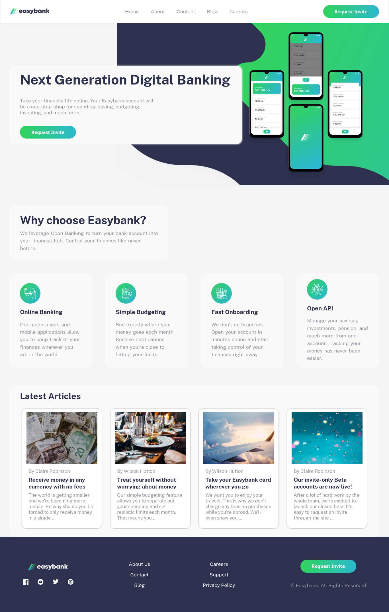

<div id="top"></div>

<br />
<div align="center">
  <a href="https://github.com/imadbg01/Easybank-landing-page">
    
  </a>

<h1 align="center">Easybank landing page solution</h1>

  <p align="center">
  This is a solution to the <a href="https://www.frontendmentor.io/challenges/easybank-landing-page-WaUhkoDN">Easybank landing page challenge on Frontend Mentor </a>. Frontend Mentor challenges help you improve your coding skills by building realistic projects.
    <br />
    <a href="https://www.frontendmentor.io/challenges/easybank-landing-page-WaUhkoDN"><strong>Check the hub »</strong></a>
    <br />
    <br />
    <a href="https://imadbg01.github.io/Easybank-landing-page/">View My Demo</a>
    ·
    <a href="https://github.com/imadbg01/Easybank-landing-page/issues">Report Bug</a>
    ·
    <a href="https://github.com/imadbg01/Easybank-landing-page/issues">Request Feature</a>
  </p>
</div>

## Table of contents

- [Overview](#overview)
  - [The challenge](#the-challenge)
  - [Screenshot](#screenshot)
  - [Links](#links)
- [My process](#my-process)
  - [Built with](#built-with)
  - [What I learned](#what-i-learned)
  - [Continued development](#continued-development)
  - [Useful resources](#useful-resources)
- [Author](#author)
- [Acknowledgments](#acknowledgments)

## Overview

### The challenge

Users should be able to:

- View the optimal layout for the site depending on their device's screen size
- See hover states for all interactive elements on the page

### Screenshot



### Links

- Solution URL: [Add solution URL here](https://your-solution-url.com)
- Live Site URL: [Add live site URL here](https://imadbg01.github.io/Easybank-landing-page/)

## My process

### Built with

- Semantic HTML5 markup
- CSS custom properties
- Flexbox
- CSS Grid
- Mobile-first workflow

### What I learned

To see how you can add code snippets, see below:

```html
<h1>Some HTML code I'm proud of</h1>
```

```css
.proud-of-this-css {
  color: papayawhip;
}
```

```js
const proudOfThisFunc = () => {
  console.log("🎉");
};
```

If you want more help with writing markdown, we'd recommend checking out [The Markdown Guide](https://www.markdownguide.org/) to learn more.

### Continued development

Use this section to outline areas that you want to continue focusing on in future projects. These could be concepts you're still not completely comfortable with or techniques you found useful that you want to refine and perfect.

### Useful resources

- [Example resource 1](https://developer.mozilla.org/en-US/docs/Learn/Accessibility/HTML) - This helped me for XYZ reason. I really liked this pattern and will use it going forward.
- [Example resource 2](https://www.example.com) - This is an amazing article which helped me finally understand XYZ. I'd recommend it to anyone still learning this concept.

## Author

- Website - [Add your name here](https://www.your-site.com)
- Frontend Mentor - [@yourusername](https://www.frontendmentor.io/profile/yourusername)
- Twitter - [@yourusername](https://www.twitter.com/yourusername)

## Acknowledgments

This is where you can give a hat tip to anyone who helped you out on this project. Perhaps you worked in a team or got some inspiration from someone else's solution. This is the perfect place to give them some credit.
